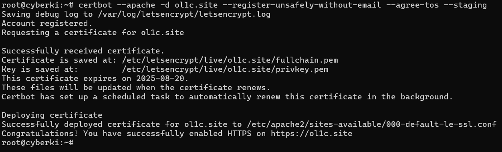
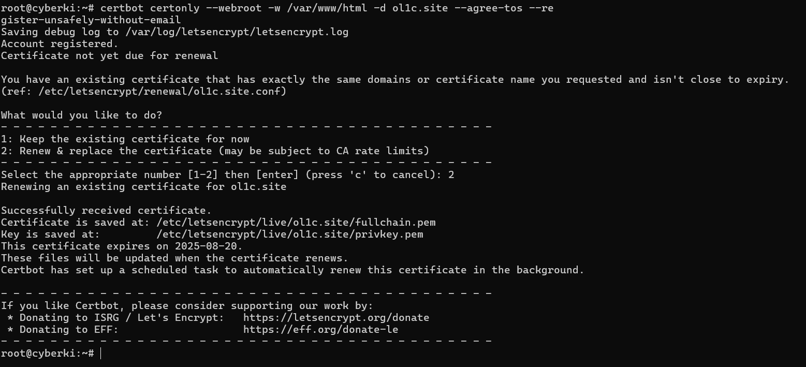

# Instalacja i aktualizacja certyfikatu Let's Encrypt dla serwera WWW

*Olivia Jackiewicz 197920*

*Oliwier Komorowski 197808*

*Jakub Nowak 197860*


## **Spis treści**

1. [Wstęp](#wstep)
2. [Wprowadzenie do Let's Encrypt](#wprowadzenie-do-lets-encrypt)
3. [Metody weryfikacji własności domeny](#metody-weryfikacji-własności-domeny)
4. [Instalacja certyfikatu Let's Encrypt](#instalacja-certyfikatu-lets-encrypt)
5. [Instalacja certyfikatu na serwerze WWW (Apache, Lighttpd, Caddy)](#instalacja-certyfikatu-na-serwerze-www)
6. [Odnawianie certyfikatu](#odnawianie-certyfikatu)
7. [Instalacja certyfikatu w środowisku hostingowym](#instalacja-certyfikatu-w-środowisku-hostingowym)
8. [Podsumowanie](#podsumowanie)

---
## 1. Wstęp

Certyfikaty SSL (Secure Socket Layer) są kluczowym elementem bezpieczeństwa w sieci, umożliwiającym szyfrowaną komunikację pomiędzy użytkownikiem a serwerem WWW. Let's Encrypt to darmowy, automatyczny i otwarty dostawca certyfikatów SSL.

Niniejszy dokument przedstawia proces instalacji, aktualizacji i odnowienia certyfikatów Let's Encrypt z wykorzystaniem różnych serwerów WWW oraz środowisk hostingowych.
  
---
## 2. Wprowadzenie do Let's Encrypt

Let's Encrypt to urząd certyfikacji (CA), który oferuje:

- Bezpłatne certyfikaty ważne 90 dni,
- Automatyzację wystawiania i odnawiania certyfikatów za pomocą protokołu ACME,
- Otwartość i transparentność działania (publiczny rejestr wydanych certyfikatów).

Jego głównym celem jest uproszczenie wdrażania HTTPS, szczególnie przez małe strony i projekty.

  
---
## 3. Metody weryfikacji własności domeny
  

Przed wydaniem certyfikatu Let's Encrypt wymaga potwierdzenia, że domena należy do osoby składającej żądanie. Obsługiwane są trzy główne metody:
  

### 3.1 HTTP-01
  

- Polega na umieszczeniu pliku z tokenem w katalogu `.well-known/acme-challenge/` na serwerze HTTP.
- Let's Encrypt wysyła żądanie HTTP do serwera i weryfikuje obecność tokena.
- Wymaga otwartego portu **80**.

**Zalety:** prostota i szybkość, dobra automatyzacja.

**Wady:** brak obsługi wildcard, konieczność działającego serwera HTTP.

  
### 3.2 DNS-01


- Polega na dodaniu rekordu TXT `_acme-challenge` do strefy DNS domeny.

- Let's Encrypt sprawdza zawartość rekordu.

**Zalety:** możliwość wystawiania certyfikatów wildcard, nie wymaga portu 80.

**Wady:** wymaga dostępu do konfiguracji DNS, propagacja może trwać.


### 3.3 TLS-ALPN-01

- Opiera się na specjalnym rozszerzeniu TLS.
- Wymaga nasłuchiwania na porcie **443** z odpowiednią konfiguracją TLS.
- Rzadziej stosowana, wspierana np. przez serwer Caddy.

  

#### Porównanie metod


| Metoda        | Wildcard | Potrzebny port | Szybkość | Automatyzacja       |
|:--------------|:--------:|:--------------:|:--------:|:--------------------|
| HTTP-01       | Nie      | 80             | Wysoka   | Wysoka              |
| DNS-01        | Tak      | brak           | Średnia  | Niższa              |
| TLS-ALPN-01   | Nie      | 443            | Wysoka   | Wysoka (Caddy)      |
  
---
## 4. Instalacja certyfikatu Let's Encrypt

### 4.1 Przygotowanie systemu

```shell
ssh  root@<ADRES_IP>
apt  update && apt  upgrade  -y
```

### 4.2 Instalacja narzędzi

  

**Apache:**
```shell
apt  install  -y  apache2  certbot  python3-certbot-apache  ufw
```

**Lighttpd:**

```shell
apt  install  -y  lighttpd  certbot  python3-certbot-lighttpd  ufw
```

 
**Zapora:**

```shell
ufw  allow  OpenSSH
ufw  allow  'Apache Full'
ufw  allow  80
ufw  allow  443
ufw  enable
```

Po wykonaniu powyższych czynności strona prezentuje się następująco:


  

### 4.3 Środowiska Let's Encrypt: Staging vs Production

Let's Encrypt oferuje dwa środowiska:

  

-  **Staging:** do testowania konfiguracji, pozwala uniknąć limitów produkcyjnych. Certyfikaty są nieważne w przeglądarkach.
-  **Production:** generuje prawdziwe, zaufane certyfikaty. Obowiązują limity (np. 50 certyfikatów na domenę tygodniowo).

  

Użycie flagi `--staging` jest zalecane przy pierwszych testach i automatyzacji:

  

```shell
certbot  --apache  -d  domena.pl  --staging
```

---
## 5. Instalacja certyfikatu na serwerze WWW

  
### 5.1 Różnica Apache vs Lighttpd

  
-  **Apache** to rozbudowany, popularny serwer WWW z szerokim wsparciem dla modułów, np. mod_ssl, mod_rewrite. Domyślny wybór w wielu systemach.
-  **Lighttpd** to lekki, szybki serwer zoptymalizowany do środowisk o ograniczonych zasobach. Mniej popularny, ale wydajny i prostszy w konfiguracji.

  
### 5.2 Tryb staging


**Apache:**

  

```shell
certbot  --apache  -d  twoja-domena.pl  --staging  --agree-tos  --register-unsafely-without-email
```

  

**Lighttpd (webroot)**

 
```shell
certbot  certonly  --webroot  -w  /var/www/html  -d  twoja-domena.pl  --agree-tos  --register-unsafely-without-email
```

Po wykonaniu powyższych kroków otrzymujemy rezultat:


### 5.3 Tryb produkcyjny

Jak widzimy powyżej, pozostanie na środowisku testowym uniemożliwia odpalenie certyfikatu. Należy przejść na tryb produkcyjny usuwając `--staging`.  
  - np. Lighttpd:

``` shell
certbot certonly --webroot -w /var/www/html -d twoja-domena.pl --agree-tos --register-unsafely-without-email
```
  


Strona jest już **zabezpieczona**


### 5.4 Caddy

  

Caddy to serwer WWW, który automatyzuje uzyskiwanie i odnawianie certyfikatów Let's Encrypt:

  

- Obsługuje HTTP-01 i TLS-ALPN-01.

- Wystarczy odpowiedni wpis w `Caddyfile`, np.:

  

```caddy
example.com {
root * /var/www/html
file_server
tls user@example.com
}
```

  

Uruchomienie:

  

```shell
./caddy  run
```

Certyfikat zostanie automatycznie pobrany i aktywowany.

---
## 6. Odnawianie certyfikatu


Certyfikaty Let's Encrypt są ważne przez 90 dni. Zalecane jest automatyczne odnawianie.


### 6.1 Automatyczne odnawianie (certbot)


Certbot instaluje domyślnie `certbot.timer`:


```shell
systemctl  status  certbot.timer
```


### 6.2 Ręczne testowe odnowienie


```shell
certbot  renew  --dry-run
```

  

### 6.3 Produkcyjne odnowienie


```shell
certbot  renew
```

### 6.4 Sprawdzenie ważności certyfikatu


```shell
openssl  x509  -enddate  -noout < /etc/letsencrypt/live/twoja-domena.pl/cert.pem
```


---
## 7. Instalacja certyfikatu w środowisku hostingowym

  

### 7.1 AutoSSL w cPanel

  

- Zaloguj się do **cPanel**.

- Przejdź do **SSL/TLS Status**.

- Zaznacz domeny i kliknij **Run AutoSSL**.

- Certyfikat zostanie zainstalowany automatycznie.

- Odwiedź `https://twoja-domena.pl`, aby zweryfikować działanie.

  

### 7.2 Odnawianie

Większość hostingów odnawia AutoSSL automatycznie co 60–90 dni.


---
## 8. Podsumowanie


Let's Encrypt to nowoczesne, darmowe i bezpieczne rozwiązanie do zapewnienia komunikacji HTTPS. Obsługuje wiele metod weryfikacji własności domeny, co pozwala dopasować proces do konkretnego środowiska.
Certbot, Apache, Lighttpd, Caddy oraz panele hostingowe takie jak cPanel umożliwiają szybkie i skuteczne wdrożenie certyfikatu SSL dla każdej strony WWW.
