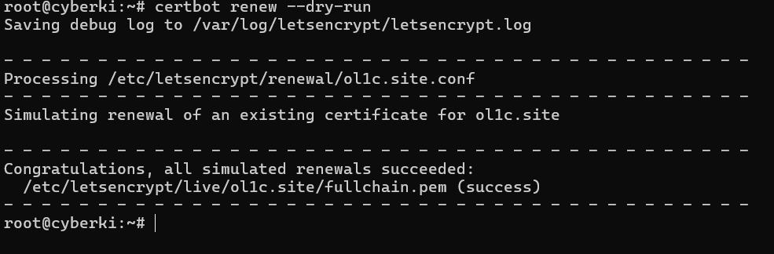
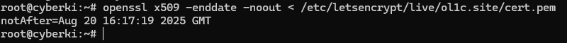

**Projekt – Instalacja i aktualizacja certyfikatu Let's Encrypt dla serwera WWW**

---

## 1. Instalacja

    ```bash
    ssh root@<ADRES_IP>
    apt update && apt upgrade -y
    ```

1.  **Instalacja Apache + Certbot**

    ```bash
    apt install -y apache2 certbot python3-certbot-apache ufw
    ```

2.  **Instalacja Lighttpd + Certbot**

    ```bash
    apt install -y lighttpd certbot python3-certbot-lighttpd ufw
    ```

```bash
ufw allow OpenSSH
ufw allow 'Apache Full'
ufw allow 80
ufw allow 443
ufw enable
```

3. **Test serwera**

   - `http://test.example.pl` powinno wyświetlić stronę Apache.
     

---

## 2. Instalacja certyfikatu na serwerach WWW

1. **Wstępne testy w trybie staging**:

   2.1.1 **Apache**:

   ```bash
   certbot --apache -d twoja-domena.pl --staging --agree-tos --register-unsafely-without-email
   ```

   

   2.1.2 **Lighttpd**:

   ```bash
   certbot certonly --webroot -w /var/www/html -d twoja-domena.pl --staging --agree-tos --register-unsafely-without-email
   ```

2. **Test produkcyjny** (usuń `--staging`):

   ```bash
   certbot certonly --webroot -w /var/www/html -d twoja-domena.pl --agree-tos --register-unsafely-without-email
   ```

   

---

## 3. Odnawianie certyfikatu

1. **Automatyczne (`certbot renew`)**

   - Domyślnie zainstalowane cron/systemd timer.
   - Sprawdź: `systemctl status certbot.timer`.

2. **Aktualizacja (odnawianie) certyfikatu**

   1. Ręczne odnowienie testowe:

      ```bash
      certbot renew --dry-run
      ```

      

   2. Sprawdź status odnawiania:

      ```bash
      systemctl status certbot.timer
      ```

   3. Jeśli chcesz wymusić natychmiastowe odnowienie (produkcja):

      ```bash
      certbot renew
      ```

   4. Po odnowieniu Apache automatycznie przeładuje skonfigurowane serwisy. W razie potrzeby:

      ```bash
      systemctl reload apache2
      ```

3. **Weryfikacja ważności certyfikatu**

   Sprawdź datę wygaśnięcia:

   ```bash
   openssl x509 -enddate -noout < /etc/letsencrypt/live/twoja-domena.pl/cert.pem
   ```

   

---

## 4. Instalacja w środowisku hostingowym (cPanel)

1. **AutoSSL**

   - W cPanelu wejdź w **SSL/TLS Status** → **Run AutoSSL** → wybierz Let’s Encrypt.

2. **Ręczna instalacja**

   - W cPanelu: **SSL/TLS → Certificates → Upload**, wklej PEM (cert i klucz).

3. **Automatyczne odnawianie**

   - Skonfiguruj **AutoSSL** lub crontab przez **Cron Jobs** w panelu.

---
